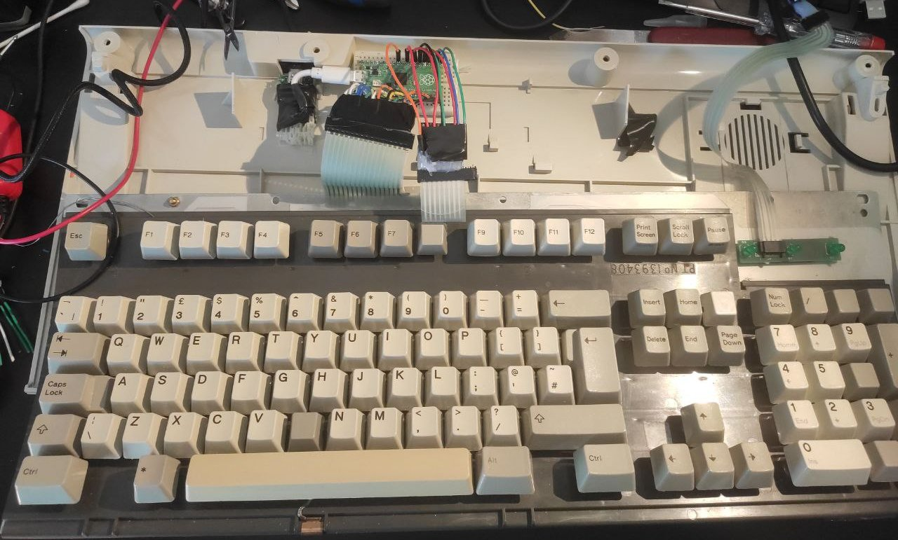
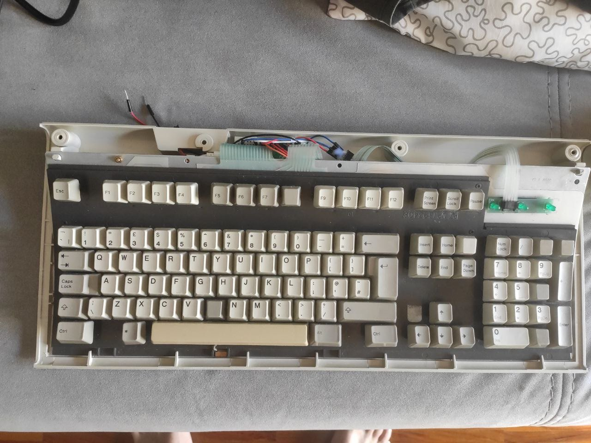
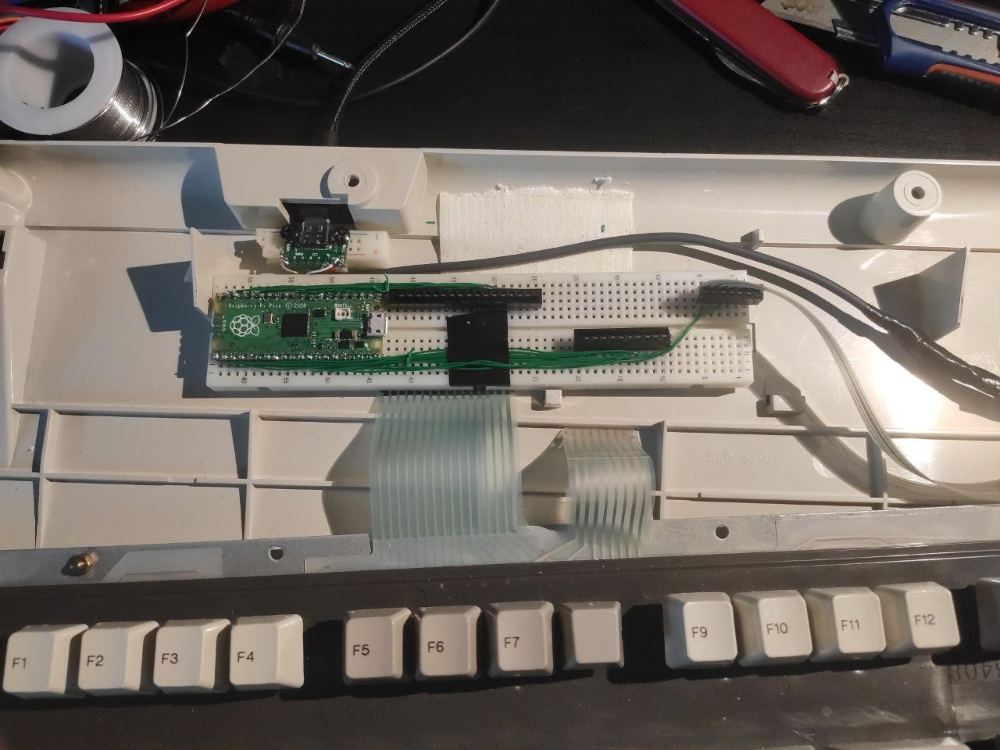
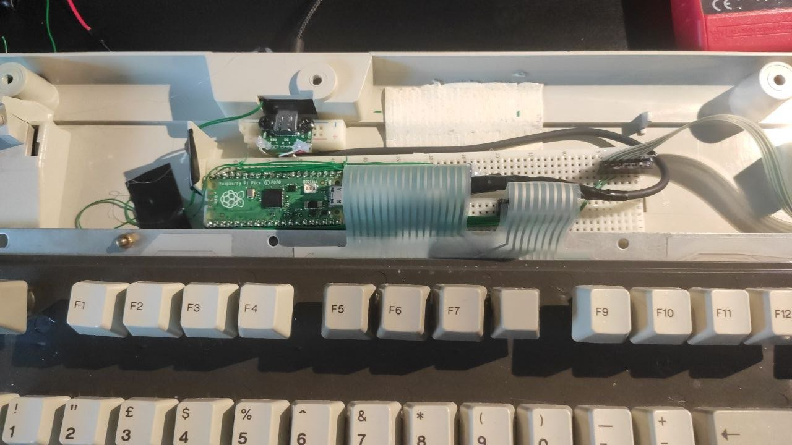

# IBM model Pi

## Wiring

### How to connect ribbon 16 pins (r0..r15) (read pins of the ribbon starting from left) to the pi pico

- r0 -> gpio0 (also add a second cable which should go outside of the chassis)
- r1 -> gpio1
- r2 -> gpio2
- r3 -> gpio3
- r4 -> gpio4
- r5 -> gpio5
- r6 -> gpio6
- r7 -> gpio7
- r8 -> gpio8
- r9 -> gpio9
- r10 -> gpio10
- r11 -> gpio11
- r12 -> gpio12
- r13 -> gpio13
- r14 -> gpio14
- r15 -> gpio15

### How to connect ribbon 8 pins (r0..r7) to the pi pico

- r0 -> gpio26
- r1 -> gpio22
- r2 -> gpio21
- r3 -> gpio20
- r4 -> gpio19
- r5 -> gpio18
- r6 -> gpio17
- r7 -> gpio16 (also add a second cable which should go outside of the chassis)

### How to connect ribbon 4 pins (r0..r3) to the pi pico

- r0 -> gpio27
- r1 (thickest one) -> VSYS
- r2 -> gpio28
- r3 -> NONE (there is no GPIO left)

## The software 

First of all you have to install circuit python on the Pi pico.
To do so, follow the instruction on [the adafruit site](https://learn.adafruit.com/getting-started-with-raspberry-pi-pico-circuitpython/circuitpython)

Next follow the [getting started guide by KMK team](https://github.com/KMKfw/kmk_firmware/blob/master/docs/Getting_Started.md)

Now you are ready to just copy the repo code and paste to the pico storage

## If you added extra cables to the GPIO0 and GPIO16
then you can uncomment the code in the [boot.py](./boot.py).

What the code does it hides a pico storage. You can still access.
To do so, connect the extra cables (GPIO0 and GPIO16) during boot and the storage should appear.

### Happy hacking

## Some pics

### Edit

I have created a new controller based on the breadboard

